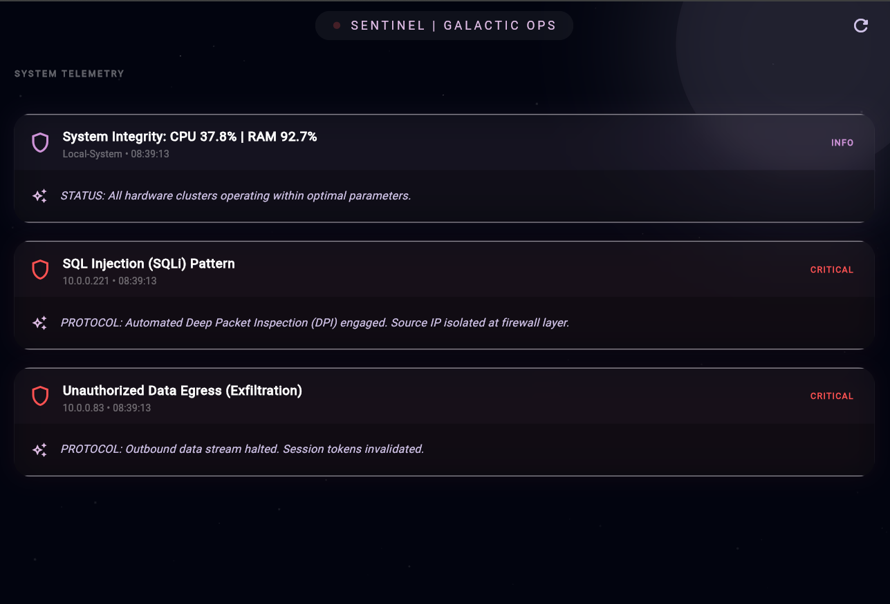

# SENTINEL-AIOps: Autonomous System Telemetry & Heuristic Threat Detection 🛰️

**Lead Researcher:** Mohosana Maymuna  
**Affiliation:** Zhengzhou University  
**Project Theme:** AiDevOps & Intelligent Infrastructure Resilience

---

## 🔬 Scientific Abstract
Sentinel-AIOps is a research artifact centered on **AiDevOps**—the integration of artificial intelligence into DevOps workflows to automate system health and security. This prototype evaluates the efficacy of **Heuristic Pattern Recognition** in distributed environments. By utilizing a decoupled **Hybrid Telemetry Engine**, the system bridges the gap between low-level hardware metrics and high-level adversarial threat vectors, demonstrating **Security Orchestration, Automation, and Response (SOAR)** logic in a mobile-first command center.

---

## 🚀 Live Command Center (Visual Evidence)

> **Fig 1:** Sentinel Galactic Ops Interface demonstrating real-time telemetry dispatch and AI-driven remediation protocols.

---

## 📋 Key Technical Features
* **Hybrid Telemetry Engine:** Real-time hardware extraction from the host kernel via the `psutil` library.
* **Heuristic Threat Matrix (v1.0):** Simulated detection of adversarial signatures (SQLi, DDoS, Exfiltration).
* **Decoupled REST API Architecture:** Professional v1 API gateway connecting a Python-Flask backend to a Flutter client.
* **Galactic Glassmorphism UI:** A premium "Space-Grade" interface featuring custom StarField painting and real-time pulse animations.

---

## 🛠️ System Architecture
* **Backend:** Python 3.10+, Flask (REST API Gateway), Flask-CORS.
* **Hardware Layer:** `psutil` (Kernel Telemetry Extraction).
* **Frontend:** Flutter SDK (Dart), HTTP/JSON Telemetry Parsing.

---

## 🏁 Conclusion & Future Horizons
The **Sentinel-AIOps** framework represents a successful integration of **Autonomous Telemetry** and **Adversarial Modeling**. By developing a decoupled, full-stack bridge between a Python-based security kernel and a Flutter-driven Command Center, I have demonstrated the technical feasibility of **Real-Time Security Orchestration (SOAR)**.

This project is a testament to my commitment as a **Rank 3rd (out of 41)** Software Engineering student to bridge the gap between high-level AI logic and low-level system security. 

**Future Roadmap:**
*   **Edge Integration:** Porting the telemetry engine to IoT edge-nodes for distributed network defense.
*   **LLM Fine-Tuning:** Implementing a localized Llama-3 model for automated "Root Cause Analysis" (RCA).
*   **Global Impact:** Deploying this framework as an open-source tool for NGOs and educational institutions in emerging economies to secure their digital infrastructure.

---
**"Engineering is not just about building tools; it is about architecting a safer digital future."**
© 2026 Mohosana Maymuna | Zhengzhou University
